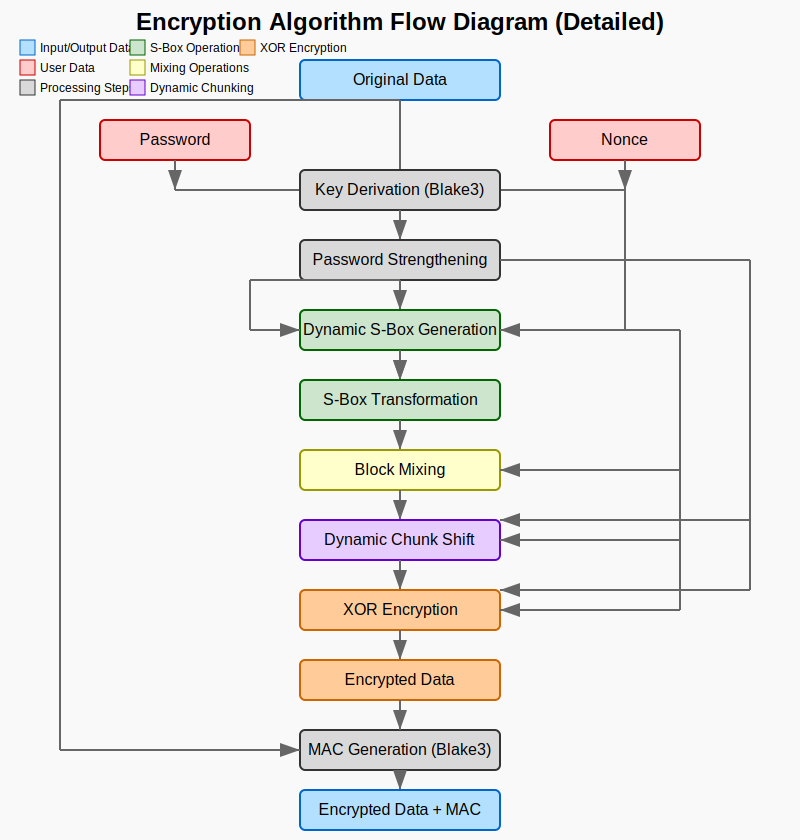
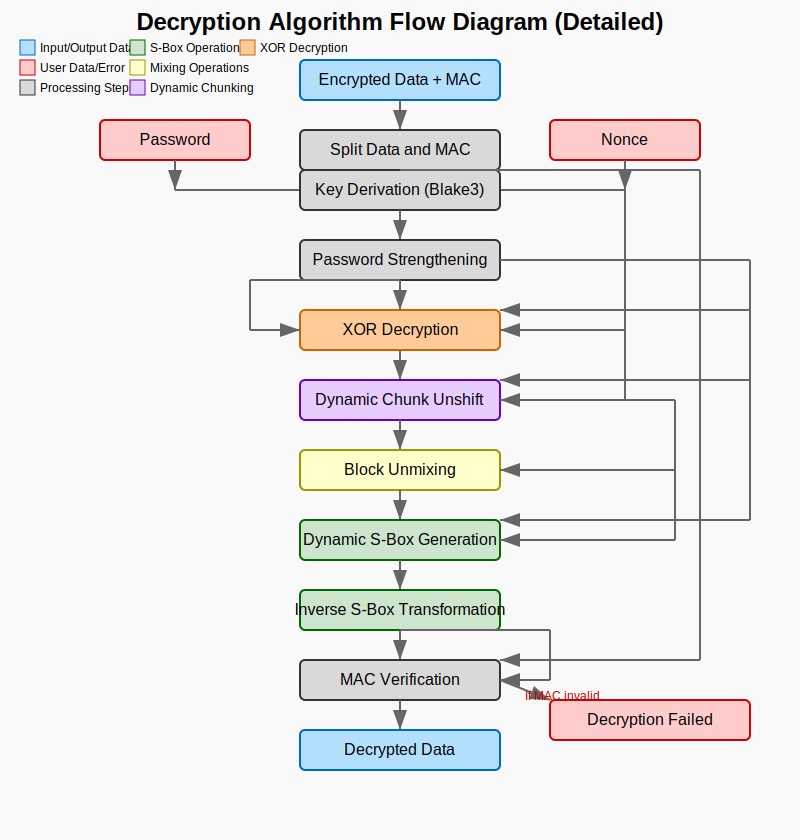

## 🧭 Use Cases

AtomCrypte is designed for scenarios where standard encryption isn't enough, and you need a multi-layered cryptographic defense mechanism built with flexibility, chaos, and paranoia in mind.

- 🔐 Personal File Encryption  
Encrypt sensitive documents, backups, notes, or password vaults with a custom-built algorithm designed to resist brute-force attacks and pattern analysis.

- 🚧 AtomCrypte is Experimental  
This algorithm is currently in development and has **not undergone formal cryptographic review**. It is intended for **educational, research, and advanced user experimentation.**

- 🚫 Not Suitable for Real-Time Use (Yet)  
Due to its computational complexity and chunk-heavy structure, AtomCrypte is **not designed for low-latency or real-time environments** (e.g., video streaming, VoIP).

# ⚛️ How AtomCrpyte works?

## Math Behind XOR Funtions:
1. xor_encrypt Function: ``C[i] = ((P[i] ⊕ (N[i % len(N)] ⊕ K[i % len(K)])) <<< rot) + N[i % len(N)] + K[i % len(K)]``
2. xor_decrypt Funtion: ``P[i] = ((C[i] - K[i % len(K)] - N[i % len(N)]) >>> rot) ⊕ (N[i % len(N)] ⊕ K[i % len(K)])``

## Math Behind Block Mixing Functions:
1. mix_blocks Function: Y = ``(((X + N) >>> rot) ⊕ N) + N``
2. unmix_blocks Function: ``X = ((Y - N) ⊕ N) <<< rot) - N``

## Math Behind S-box Generation:
1. For i from 255 down to 1:
   ``index = (seed[i % len(seed)] + seed[(i*7) % len(seed)]) % (i+1)``
   ``swap S-box[i] and S-box[index]``

## Math Behind dynamic_chunk_shift & dynamic_chunk_unshift Operation:
1. Shift: ``for each chunk:
    for each byte b in chunk:
        b = b <<< (N[i % len(N)] % 8)
        b = b ⊕ K[i % len(K)]``
2. Unshift: ``for each chunk:
    for each byte b in chunk:
        b = b ⊕ K[i % len(K)]
        b = b >>> (N[i % len(N)] % 8)``

## Math Behind Password Strengthening:
1. For 100 iterations:
   - ``Add: P[i] = P[i] + N[i % len(N)]``
   - ``Rotate & XOR: P[i] = (P[i] >>> 3) ⊕ N[i % len(N)]``
   - ``Add: P[i] = P[i] + N[i % len(N)]``
   - ``Multiply: P[i] = P[i] * (N[i % len(N)] | 1)``
   - ``Every 10 iterations: P = Blake3(P)``

## Encryption Flow:
1. ``K = encrypt_password(derive_key(password, nonce), nonce)``
2. ``S = generate_dynamic_sbox(nonce, K)``
3. ``D1 = s_bytes(data, S)``
4. ``D2 = mix_blocks(D1, nonce)``
5. ``D3 = dynamic_chunk_shift(D2, nonce)``
6. ``encrypted = xor_encrypt(nonce, K, D3)``
7. ``mac = blake3::keyed_hash(blake3::hash(encrypted), data)``
8. ``output = encrypted || mac``

## Decryption Flow:
1. ``K = encrypt_password(derive_key(password, nonce), nonce)``
2. ``(encrypted, mac) = split_at(data, len(data) - 32)``
3. ``D3 = xor_decrypt(nonce, K, encrypted)``
4. ``D2 = dynamic_chunk_unshift(D3, nonce)``
5. ``D1 = unmix_blocks(D2, nonce)``
6. ``decrypted = in_s_bytes(D1, nonce, K)``
7. ``verify_mac = blake3::keyed_hash(blake3::hash(encrypted), decrypted)``
8. ``if verify_mac != mac then panic("Decryption Failed")``
9. ``return decrypted``

## Encryption Flow Diagram:

*→ Encryption process including dynamic S-box, chunk shifting, and MAC generation.*

## Decryption Flow Diagram:

*→ Full decryption pipeline with constant-time MAC verification and exact reverse order.*
